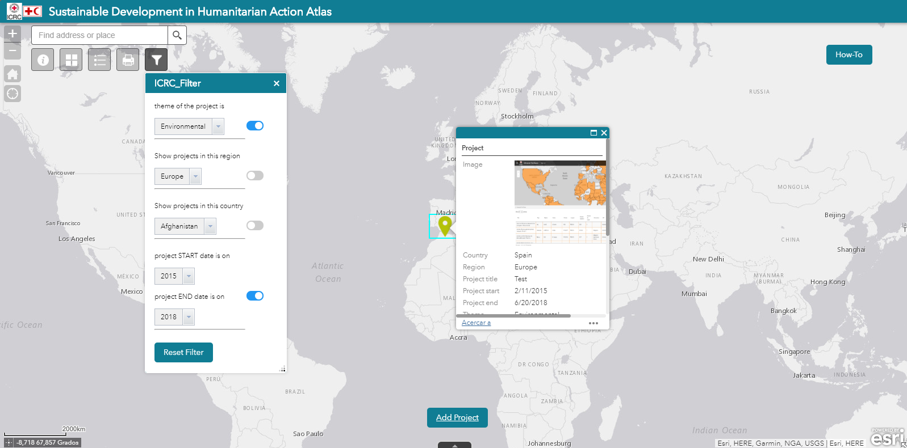

# Sustainable Development Web App Builder 2.8 App

The atlas catalogues sustainability initiatives implemented around the world by different humanitarian organisations. The sustainability initiatives are colour coded by themes: social (yellow), environmental (green) and economic (blue). The aim of the atlas is to make these initiatives more visible and to encourage sharing of sustainability best practices among humanitarian organisations.
